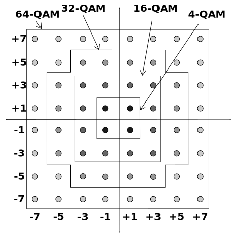
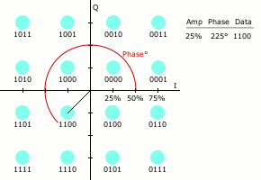
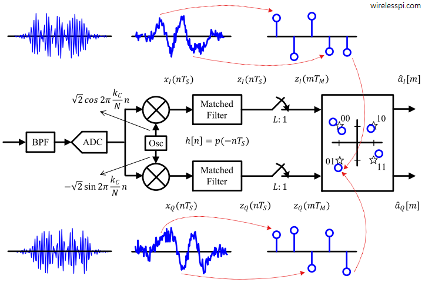

QAM 同时利用信号的幅度和相位传递信息。理解了 MASK 之后，我们理解 MQAM 就简单了，因为 MQAM 就相当于两个 MASK 的正交载波调制的和。

我们首先将 QAM 的信号相位通过数学分解，写成“正交载波调制的形式”。观察这个数学形式我们可以发现，它实际上是由两个 ASK 信号经过正交载波调制后，再相加，这样形成的。这两个 ASK 信号，一个是 $$a * cos \theta$$，一个是 $$a * sin \theta$$。

要理解 QAM 的正交载波调制，最好的办法是看“星座图”。如下图所示。

让我们观察 16QAM 的星座图。如上图所示，16QAM 的星座图包括 16 个星座点。这些星座点组成一个 4 * 4 的矩形。每个星座点到原点的距离，就是它的幅度 a；它相对于 X 轴的角度，就是它的相位 $$\theta$$，如下图所示：

那么，每个星座点在 X 轴和 Y 轴上的投影，就是它代表的 QAM 信号的两个 ASK 调制信号的幅度：一个是 $$a * cos \theta$$，一个是 $$a * sin \theta$$。

从这个星座图中，我们还可以发现 16QAM 的一种神奇的生成方法。我们来观察这 16 个星座点在 X 轴和 Y 轴上的投影。它有四种不同的值，比如 -3，-1，1，3。这不就是我们学过的 4ASK 的四种幅值吗？因此，我们就可以用正交载波调制的方法，很方便地实现 16QAM。具体方法如下图所示：

我们将输入的 4 个比特作为一组，对它进行“串并转换”，变成两路。将其中的一路做 sin 载波的 4ASK （它的四个幅值是 -3，-1，1，3，能在一个符号内传输 2 个比特），另一路做 cos 载波的 4ASK （它的四个幅值也是 -3，-1，1，3，也能在一个符号内传输 2 个比特），然后把两路 ASK 信号加起来，同时传输。这就完美地实现了我们前面分析过的 16QAM。

因此，在发送端，我们只要做“串并转换”，然后分别 ASK 就可以了。在接收端，我们做 ASK 解调后，做“并串转换”就可以了。非常简单。如下图所示：

注意，上图中我们采用了匹配滤波器进行解调。匹配滤波器的内容将会在后面的最佳接收部分学习。

类似的，我们也可以得到 64 QAM（一个符号内传输 6 个比特，其中 3个 用 8ASK 在 cos 上传，另外 3个 用 8ASK 在 sin 上传）、256 QAM。

我们最后分析它的有效性和可靠性。因为 QAM 可以分解为两路 MASK 的并行传输，所以它的带宽（代表有效性）和误码率（代表可靠性）都可以通过 MASK 的相应结果推导出来的。详见课程 PPT 或课本。

下面是 Quiz：

1. MQAM 的英文全称是？
1. 为什么 MQAM 能在同一带宽内实现两路并行数字信息传输？
1. 如何实现 MQAM？
1. 为什么 MQAM 也叫 APK？
1. MQAM 有什么好处？
1. 画出 16QAM 的调制系统框图，给出输入为01111000000111100010 时的各模块输出
1. 写出 MQAM 信号的时域表达式，解释其中每个符号的物理意义。将其进行数学分解，写为两路并行数字信息传输的形式，其中 I(t)，Q(t) 的数学形式分别是？
1. 4QAM，如果我们把 11 送出，对应的 I(t)，Q(t) 中的 a 和 $$\theta$$ 分别是多少？如果我们送的是01. 对应的 a 和 $$\theta$$ 又是多少？
1. 画出 4QAM 的星座图，在上面分别标出 11 和 00 的矢量
11. 4QAM 星座图有几种幅值，几种相位？
11. 16QAM，如果我们把 1111 送出，对应的I(t)，Q(t) 中的 a 和 $$\theta$$ 分别是多少？如果我们送的是 0001. 对应的 a 和 $$\theta$$ 又是多少？
11. 画出 16QAM 的星座图，在上面分别标出 1111 和 0000 的矢量。
11. 16QAM 星座图有几种幅值，几种相位？
11. 为什么说 MQAM 的调制解调简单？
11. 画出 MQAM 信号的功率谱图形。其带宽是多少？频带利用率是多少？
11. 画出 MQAM 相干解调（相干接收）系统框图。
11. 如何分析 MQAM 信号相干解调（相干接收）的误码性能（包括误码率和误比特率）？请分别说明。

### 参考文献

- Qasim Chaudhari, Quadrature Amplitude Modulation (QAM), [网页](https://wirelesspi.com/quadrature-amplitude-modulation-qam/)

 

|[Index](./) | [Previous](5-9-mask) | [Next](5-13-mpsk)|
