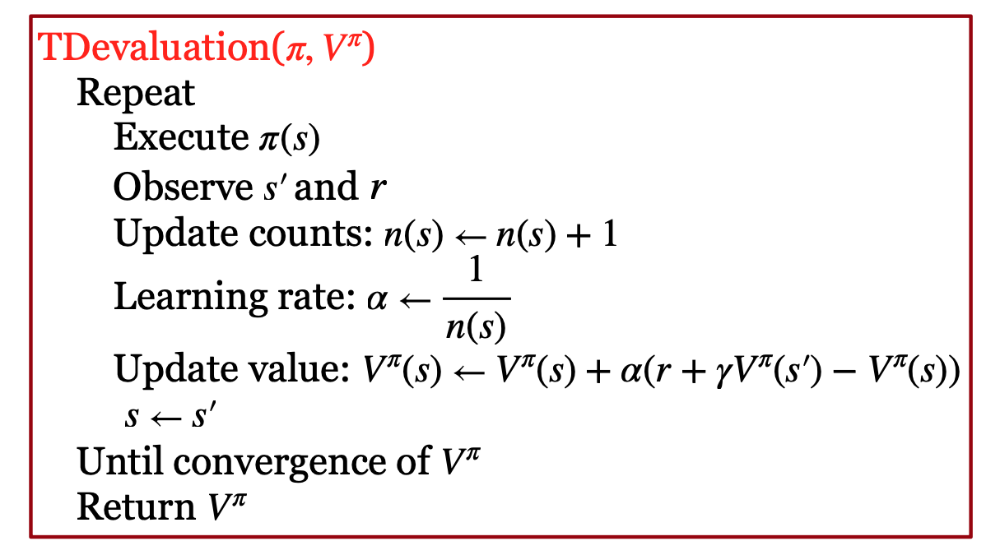
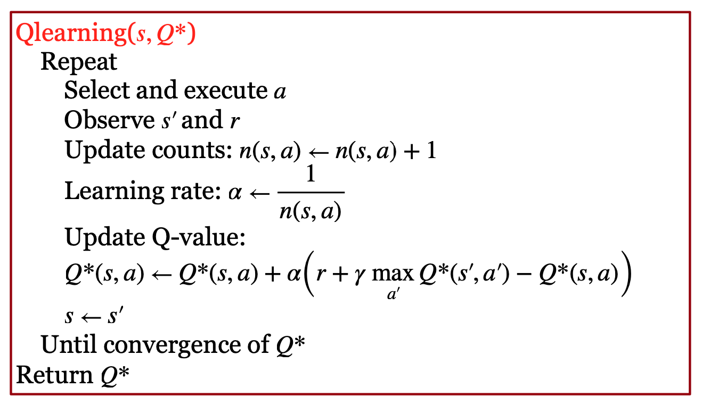

沿着 MDP Bellman 方程的思路，增强学习问题可以用“值函数”的方法，来求解。

本节首先学习如何从实验中学习每个状态的 V(s)。有两个办法：蒙特卡洛评估方法和 Temporal Difference 评估方法。

我们然后学习 Q-learning。我们通过实验获得状态 s 下执行特定策略下的动作 a 时的价值（Value）Q(s,a)。类似于从实验中学习 V(s)，我们可以用蒙特卡洛评估方法和 Temporal Difference 评估方法来学习 Q 函数。这就是 Q-learning。在 Q-learning 的学习中，我们需要平衡 Action 的“探索”和“利用”。当获得了 Q 函数后，我们就可以选择值最大的 Action，实现“控制”（Control）。

### 实验获得 V 值

当 Transition 和 Reward 模型“未知”时，就是“增强学习”问题。此时，我们需要通过和环境的交互，自己学出它们。

我们首先来看如何计算一个特定策略下的每个状态的 V。这有两个办法：

第一个方法是蒙特卡洛评估方法。我们实验多次，每次都到底。然后测量每个状态往后，得到的 Reward 总和，做统计平均，就得到 V。

我们也可以将这个统计平均，改为增量更新：每实验一次，就用得到的 Reward 和当前 V 的“差值”，乘一个因子，来更新 V。这个因子一般被设为状态 s 被经过的次数。

第二个方法是 Temporal Difference 评估（TD 评估）。下图画出了该算法。

如上图所示，我们在状态 s 按照策略执行一个 Action，然后，就用得到的 Reward r 加上进入的新状态 s' 的 V 经过 $$\gamma$$ 折扣后的值，更新原状态 s 的 V。更新的时候，采用增量更新的方法。增量更新，相当于做了指数移动平均，因此有平滑的效果，能够降低 Variance。

比较蒙特卡洛评估方法和 TD 评估方法，我们可以发现，蒙特卡洛评估方法，做一次实验，只能更新 V 一次；但用 TD 方法，每一步都会更新 V，所以 TD 方法比蒙特卡洛评估要的实验次数少。但是，蒙特卡洛评估方法是无偏估计，TD 方法是有偏的。

### Model Free 增强学习：Q-Learning

上面我们学习了 Model Free 的学习状态的值 V 的方法，但是，怎么基于更新后状态的值，得到新的策略呢？这时，V 就不够了，我们就得学习 Q。

Q 函数表示按照一定策略，在状态 s 下执行特定动作 a 后获得的最优值。有了它，最优的策略就很好确定了，就是选择值最大的 Action 就可以了。

为了学习 Q，我们就得像“值回归”那样，把各种 Action 的值都学到。因此，我们就得尝试各种 Action。这时，就需要进行 Exploration 和 Exploitation 的平衡。

我们采用类似值回归的方法，通过迭代的方法，估计一定策略下，在状态 s 下特定动作 a 的值。我们看值回归的式子。它在更新的时候，需要 V 函数。那么，假设我们采取的策略就是选择让 Q 最大的 Action a，所以，我们可以用 Q 在各种 Action 上的最大值作为 V 的近似。这样，我们就有了 Q 值函数的值回归模型。

直接学习 Q 函数的好处有三个：首先，它模型的对象是 $$(s,a)$$，因此，它可以利用老模型的数据，进行 Off-Policy 训练。其次，它只有一个 Q 函数的模型，简化了系统设计；最后，它会收敛到最优。

我们有关于 Q 函数的 Bellman 等式：

如图所示，它等于 s 下做 a 获得的 reward 的期望 + 下一个状态的 Q 函数的各种 Action 中的最大值（经过衰减后）。

这意味着我们的 Action，是按照 Q 来的：执行各个 Action 中 Q 函数最大的 Action。这其实就是我们前面学过的 Policy Iteration 方法，即：做完 Policy Evalation 之后，用能够获得最大值函数的 Action 作为最新的策略动作。

我们然后用蒙特卡洛评估或 TD 评估的方法，来获得 Q(s,a)。如果采用 TD 评估方法，那我们就得到了 Q-Learning。下图是 Q-Learning 的算法：

如上图所示，在当前状态 s 下，根据策略，执行动作 a 之后，我们用下一个进入的状态的 s‘ 的各个 Action 中的最大 Q 值，经过衰减后，加上这次执行 a 获得的 Reward r，用它来近似 s 和 a 的 Q 函数。这个过程一直重复，直到 Q 函数收敛。

在上述过程中，在当前状态 s 下，根据策略，执行动作 a 时，到底执行哪个 a 呢？如果总是选择 Q 最大的 a，这叫 “exploiting”（利用），这可能会导致我们钻牛角尖，得到次优的结果；如果随机选择 a，这叫 “exploration”（探索），这就会去计算很多后面可能从来不会用到的 a 的 Q 值，造成浪费。因此，要平衡好这两者。

因此，一般有两种探索方法：一种是 epsilon-greedy：固定概率探索；一种是 Boltzmann 探索：按Q 做 Softmax 得到的概率探索。在转换概率的时候，有一个温度参数来控制。在实际中，会慢慢减少学习率。

在训练 Q-learning 模型时，我们要注意做足够多的 Exploration；最后的 Learning Rate 要降得尽量小，但也不要降得太快。

但通过这种值回归的方法，学习 Q 函数也有一个严重的问题：如果我们用深度学习这种非线性模型来近似它的话，值回归的方法很可能不收敛。这部分内容，请参考伯克利 CS182 的 PPT。

## 课程材料

- 滑铁卢 CS486 人工智能 Reinforcement Learning ([slides](https://cs.uwaterloo.ca/~ppoupart/teaching/cs486-spring23/slides/cs486-lecture17.pdf))
- 伯克利 CS182 深度学习，Actor Critic PPT，[B 站视频](https://www.bilibili.com/video/BV1PK4y1U751?p=48)，讨论材料 9
- 伯克利 CS188 增强学习 PPT I
- Berkeley CS285 Lec 7: Value Function Methods, [slides](https://rail.eecs.berkeley.edu/deeprlcourse/), [Youtube Video](https://www.youtube.com/playlist?list=PL_iWQOsE6TfVYGEGiAOMaOzzv41Jfm_Ps)
- Stanford CS234 RL Lecture 4: Q-learning
- Silver RL 2015 Lec 5: Model-Free Control [website](https://www.davidsilver.uk/teaching/), [video](https://www.youtube.com/watch?v=2pWv7GOvuf0)

## 课本材料

- Dive in Deep Learning，[17. Reinforcement Learning](https://d2l.ai/chapter_reinforcement-learning/index.html)，Q-Learning 部分
- [RN3] Sections 21.1 - 21.3
- [SutBar] Sec. 5.1-5.4, 6.1-6.5, 6.7, [Sze] Sec. 3.1, 4.3, [SigBuf] Sec. 2.1-2.5

## 练习

- CS486 [练习 4](https://cs.uwaterloo.ca/~ppoupart/teaching/cs486-spring23/assignments.html)。
  - Q-Learning 练习：修改 RL.py 代码，实现 Q-Learning 算法。注意：该代码用 MDP.py 代码里的 MDP 对象，实现状态转移和 Reward 仿真。
- CS885 [练习 1](https://cs.uwaterloo.ca/~ppoupart/teaching/cs885-fall22/assignments.html)，Q-Learning
- 伯克利 CS285 HW 3: Q-learning and actor-critic algorithms, [Website](https://rail.eecs.berkeley.edu/deeprlcourse/)
- 伯克利 CS182 DL MuJoCo implement Imitation learning, Policy Gradients, DQN, and Actor Critic algorithms.
- Berkeley DeepRL Camp Lab 1: Markov Decision Processes. You will implement value iteration, policy iteration, and tabular Q-learning and apply these algorithms to simple environments including tabular maze navigation (FrozenLake) and controlling a simple crawler robot. [website](https://sites.google.com/view/deep-rl-bootcamp/labs)
- ana/HW6-value-iter-q-learning/reinforcement-pacman, value iteration, q-learning
- Harvard CS50 Q-learning Nim

 

|[Index](index) | [Previous](6-rl-intro) | [Next](9-drl-dqn) |
